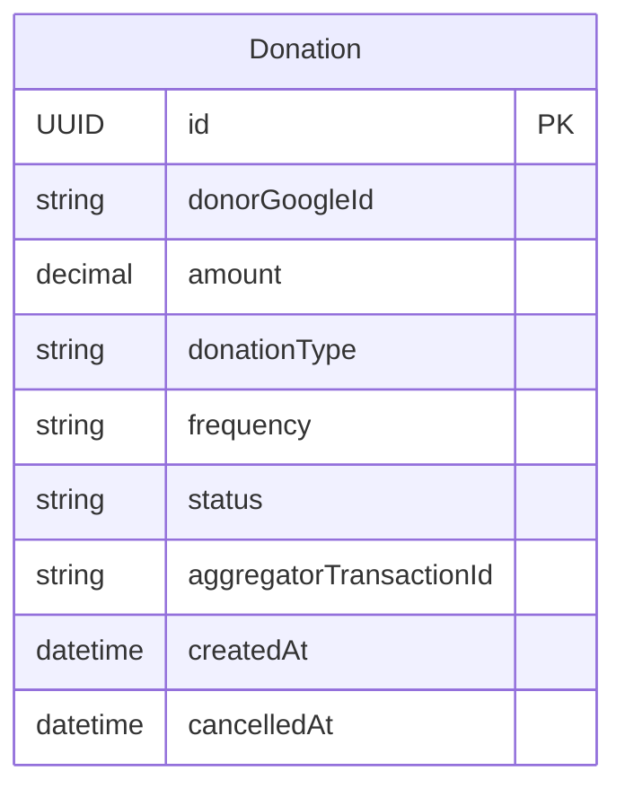

# Functional Specification — donation-unit

## Workflow: Initiate Donation

```
Flow: Initiate a one-time or recurring donation
Persona: Any signed-in user (Contract 1)
Trigger: The user submits a donation amount, type (one-time/recurring), and frequency (if recurring)
Steps:
  1. Validate the amount is positive (BR5.2)
  2. Validate frequency is present iff donationType = RECURRING (BR5.3)
  3. Create a Donation record with status = INITIATED
  4. Request a checkout session from the payment aggregator via its tokenized flow (BR5.1 — no raw payment details ever pass through this Unit)
  5. On receiving the aggregator's checkout reference, set status = PENDING and store aggregatorTransactionId
  6. Return a `DonationInitiation` (Contract 5) to the caller — carrying the new Donation's `id`, the aggregator's `checkoutUrl` to redirect the user to, and a `checkoutReference` for client-side correlation/logging — not a completed Donation
Success outcome: A Donation record exists in PENDING status, and the user is directed to the aggregator's checkout
Error paths:
  - Amount or frequency validation fails: reject before any Donation record is created, return a specific validation error
  - Aggregator checkout creation fails: Donation stays at INITIATED (never reaches PENDING); surface a plain-language error and allow retry
```

## Workflow: Payment Status Reconciliation

```
Flow: Resolve a donation's final status from the aggregator's webhook (or by checking on timeout)
Persona: System-triggered — the aggregator's webhook caller (Contract 7), or an internal timeout check
Trigger: The aggregator sends a payment-status webhook, OR a Donation has remained PENDING past the expected confirmation window
Steps:
  1a. (Webhook path) Receive the aggregator's notification; verify its signature (Contract 7)
  1b. (Timeout path) On timeout, query the aggregator's own transaction-status record directly rather than resolving from the timeout alone (BR5.4)
  2. Look up the Donation via a direct GetItem on the aggregator's `order_id` (Contract 7 — "correlates to a Donation.id"), NOT by `payment_id` (corrected at Infrastructure Design review, R-02: `order_id` and `payment_id` are distinct fields per Contract 7 — the webhook payload's `order_id` IS this Donation's `id`; `payment_id` is the aggregator's own settlement transaction identifier, used only in the next step for idempotency comparison, never as a lookup key)
  3. Compare the webhook's `payment_id` against the Donation's stored `processedPaymentId` attribute (security-design.md's Idempotent write design): if this exact `payment_id` was already processed for this Donation, return success with no further change (BR5.5 — idempotent)
  4. Otherwise, set status = SUCCEEDED or FAILED per the aggregator's actual record, and set `processedPaymentId` to this `payment_id`
Success outcome: The Donation's status accurately reflects the aggregator's own record, never an assumption from a timeout
Error paths:
  - Signature verification fails: refuse the webhook (401), do not change any Donation's status
  - No matching Donation found for the payment_id: log for investigation; do not silently create or guess a match
```

## Workflow: Cancel Recurring Donation

```
Flow: A donor cancels their own active recurring donation
Persona: A signed-in user who owns an active RECURRING Donation
Trigger: The user requests cancellation from within the app
Steps:
  1. Verify the requesting identity's Google ID matches the Donation's donorGoogleId, and the Donation is SUCCEEDED + RECURRING (BR5.6)
  2. Instruct the aggregator to stop future charges under this mandate
  3. Set status = CANCELLED and record cancelledAt
Success outcome: Future charges stop; the Donation shows as CANCELLED, and no further charges occur
Error paths:
  - Requester is not the donation's own donor: refuse (BR5.6)
  - Donation is not an active RECURRING mandate (e.g. already CANCELLED, or ONE_TIME): refuse with a specific message
  - Aggregator fails to acknowledge the stop-charges request: do not mark CANCELLED until the aggregator confirms, to avoid a false CANCELLED state while charges continue
```

## State Machine — Donation.status

| Current State | Event | Guard Condition | Next State | Actions |
|---|---|---|---|---|
| INITIATED | Aggregator checkout created | — | PENDING | Store aggregatorTransactionId |
| PENDING | Webhook: payment captured | Signature valid, not a duplicate (BR5.5) | SUCCEEDED | Record success |
| PENDING | Webhook: payment failed | Signature valid, not a duplicate (BR5.5) | FAILED | Record failure |
| PENDING | Timeout, aggregator record checked | Aggregator record shows captured (BR5.4) | SUCCEEDED | Reconcile from aggregator record |
| PENDING | Timeout, aggregator record checked | Aggregator record shows failed or absent (BR5.4) | FAILED | Reconcile from aggregator record |
| SUCCEEDED | Donor requests cancellation | `donationType = RECURRING` AND requester's Google ID = `donorGoogleId` (BR5.6) AND aggregator confirms the stop-charges request | CANCELLED | Stop future charges, set cancelledAt |

The `SUCCEEDED → CANCELLED` transition applies only when the guard condition holds. A `SUCCEEDED` donation with `donationType = ONE_TIME`, or a cancellation request from anyone other than the donor, never satisfies the guard — for a ONE_TIME donation, `SUCCEEDED` has no outgoing transition and is terminal exactly as before.

`FAILED` and `CANCELLED` are terminal — no outgoing transitions. Every state is reachable from `INITIATED`, consistent with the guardrail that every state in a lifecycle must be reachable from the initial state.

## Entity-Relationship Diagram



<!-- Text fallback: DonationUnit owns a single entity, Donation, with no
relationships to other entities in this domain — donorGoogleId is a plain
reference to the Cognito identity, not a modeled relationship. -->

## Rules Summary (derived from rules.md)

| Rule | Statement (short form) |
|---|---|
| BR5.1 | No raw payment credentials ever stored/transmitted |
| BR5.2 | Positive amount, no min/max |
| BR5.3 | Frequency required for RECURRING, absent for ONE_TIME |
| BR5.4 | Never resolve status from a timeout alone |
| BR5.5 | Webhook processing is idempotent |
| BR5.6 | Only the donor may cancel their own recurring donation |
