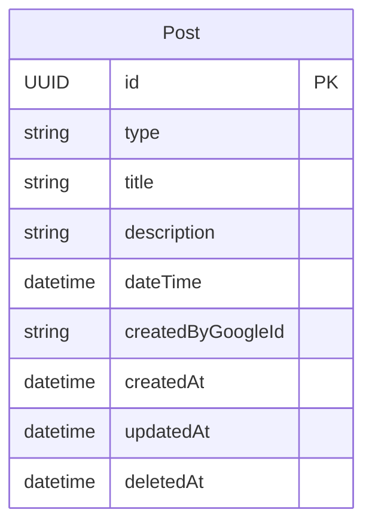

# Functional Specification — feed-unit

## Workflow: List Posts (public read)

```
Flow: Browse the feed
Persona: Any reader, signed in or not
Trigger: The reader opens the feed
Steps:
  1. Query non-deleted posts (BR2.6)
  2. Filter to posts whose dateTime is within 1 day of now or in the future (BR2.4)
  3. Sort by dateTime, most recent first
Success outcome: The reader sees current, non-deleted temple happenings
Error paths:
  - Query fails (network, backend error): plain-language error message with a retry action; no posts silently disappear from a caching layer
```

## Workflow: List Posts (admin management view)

```
Flow: An admin views every non-deleted post to manage it, including aged-out ones
Persona: A signed-in identity in the Admin group (Contract 2)
Trigger: An admin opens the post-management list, or needs to edit a specific post that has aged out of the public feed
Steps:
  1. Verify the caller is in the Admin group (BR2.7)
  2. Return every non-deleted post (no age-out filtering) via listAllPostsForAdmin, or a specific post via getPost(id)
Success outcome: >
  The admin can see and select any non-deleted post, including one that no
  longer appears in the public feed, so it can be opened for editing (see
  Edit Post below) — this is what makes BR2.5's "editing dateTime brings an
  aged-out post back" actually reachable.
Error paths:
  - Caller is not an admin: refuse (BR2.7)
  - Query fails (network, backend error): plain-language error message with a retry action
```

## Workflow: Create Post

```
Flow: An admin posts a new feed item
Persona: A signed-in identity in the Admin group (Contract 2)
Trigger: An admin submits a new post (type, title, description, dateTime)
Steps:
  1. Verify the caller is in the Admin group (BR2.3)
  2. Validate type is a declared value (BR2.1)
  3. Validate title/description length limits (BR2.2)
  4. Create the post with createdByGoogleId set to the caller's identity
Success outcome: The post appears in the public feed (subject to BR2.4's age-out filter, evaluated at read time)
Error paths:
  - Caller is not an admin: refuse (BR2.3)
  - Validation fails (bad type, over-length fields): reject with a specific error, nothing is created
  - The create request fails for an infrastructure reason (network, backend error): surface a plain-language error and allow retry; no partial post is created
```

## Workflow: Edit Post

```
Flow: An admin edits an existing post, including its dateTime
Persona: A signed-in identity in the Admin group
Trigger: An admin submits changes to an existing post (found via the admin management view above, which shows aged-out posts too — the public feed alone cannot surface one)
Steps:
  1. Verify the caller is in the Admin group (BR2.3)
  2. Validate any changed fields per BR2.1/BR2.2
  3. Apply the changes, including dateTime if changed (Q2)
  4. Update updatedAt
  5. If dateTime changed and the post is Event-type, this update lands as a DynamoDB Streams MODIFY record, which triggers Contract 8's `PostDateTimeChanged` event — ReminderUnit reschedules any Reminder it already holds for this post. FeedUnit itself does nothing further here; this step exists only so a reader of this workflow sees the downstream effect, since the actual event handling is ReminderUnit's Functional Design concern
Success outcome: >
  The post reflects the new values. If dateTime was changed, the age-out
  filter (BR2.4) re-evaluates from the new value the next time the feed is
  read (BR2.5) — an edit that moves dateTime to the future brings an
  aged-out post back into the default view with no separate "restore" step.
Error paths:
  - Caller is not an admin, or the post does not exist / is already deleted: refuse
  - Validation fails on the changed fields: reject, no partial update applied
  - The update request fails for an infrastructure reason (network, backend error): surface a plain-language error and allow retry; the post retains its pre-edit values
```

## Workflow: Delete Post

```
Flow: An admin deletes a post
Persona: A signed-in identity in the Admin group
Trigger: An admin deletes a post
Steps:
  1. Verify the caller is in the Admin group (BR2.3)
  2. Set deletedAt to the current time (BR2.6) — the record is retained, not removed
  3. This update (deletedAt transitioning from absent to set) lands as a DynamoDB Streams MODIFY record, which triggers Contract 8's `PostDeleted` event — NOT a Streams REMOVE record, since this is a soft delete and the item is never actually removed. ReminderUnit auto-cancels any Reminder it holds for this post. FeedUnit itself does nothing further here; the event handling is ReminderUnit's Functional Design concern
Success outcome: The post no longer appears in any view (public feed or the admin's own post list)
Error paths:
  - Caller is not an admin, or the post is already deleted: refuse
  - The delete request fails for an infrastructure reason (network, backend error): surface a plain-language error and allow retry; the post is not marked deleted until the operation succeeds
```

## State Machine — Post lifecycle

| Current State | Event | Guard Condition | Next State | Actions |
|---|---|---|---|---|
| NOT_DELETED | Admin deletes the post | Caller is in the Admin group (BR2.3) | DELETED | Set deletedAt |

Every post starts `NOT_DELETED` at creation. `DELETED` is terminal — no outgoing transitions (there is no in-app "undo delete"). Editing a post (title, description, dateTime) never changes this dimension; only delete does. This is a simple, purpose-specific lifecycle distinct from the age-out visibility filter (BR2.4), which is a computed read-time filter, not a stored state transition.

## Entity-Relationship Diagram



<!-- Text fallback: FeedUnit owns a single entity, Post, with no relationships
to other entities — createdByGoogleId is a plain reference to the Cognito
identity, not a modeled relationship. -->

## Rules Summary (derived from rules.md)

| Rule | Statement (short form) |
|---|---|
| BR2.1 | Post type must be a declared value |
| BR2.2 | Title/description length limits |
| BR2.3 | Only admins can create/edit/delete |
| BR2.4 | Public read filter: non-deleted, not aged-out, reverse-chronological |
| BR2.5 | Editing dateTime re-evaluates age-out |
| BR2.6 | Delete is soft, hidden from every view |
| BR2.7 | Admin management view bypasses the age-out filter |
