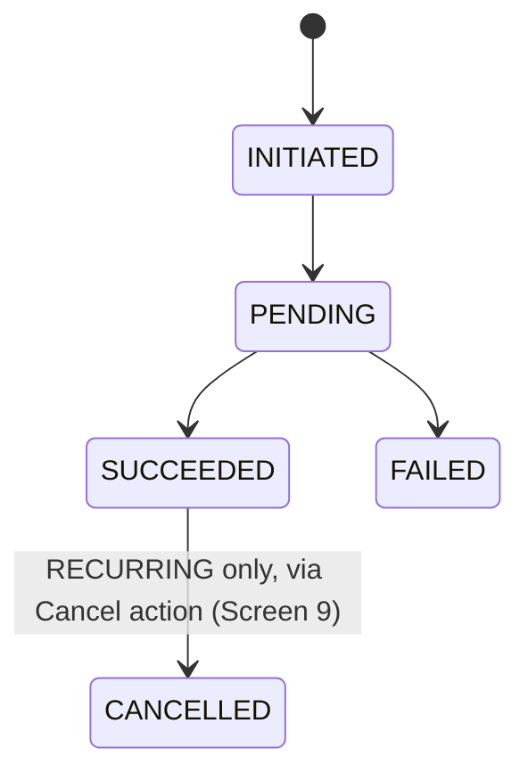
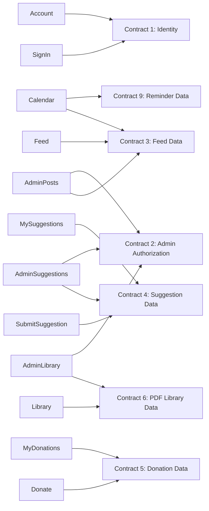

# Functional Specification — flutter-app-unit

This Unit produces `functional-spec.md` only (no `entities.md`/`rules.md` — it is a `kind: ui` Unit whose business rules and data ownership live in the six backend Units it consumes). It is self-contained per the stage's UI-unit allowance: screen inventory, navigation, and workflows are specified directly from `unit-of-work.md`, `requirements.md`, `wireframes.md`, and the nine contracts in `contract-summary.md`.

> **Amended** — Screen 12 (Calendar) added via a redo pass (backward jump from `nfr-requirements`) for the new Calendar & Reminders capability (FR7.1-FR7.8). Grounded in `reminder-unit`'s completed Functional Design (Contract 9) and this Unit's own redo-pass Q&A.

## Screen Inventory

| # | Screen | Access | Wireframed? | Backend contract(s) called |
|---|---|---|---|---|
| 1 | Feed | Public | Yes (Screen 1) | Contract 3: `listPosts` |
| 2 | Sign In | Public | Yes (Screen 2) | Contract 1 (Amplify Auth / Cognito Google federation — not GraphQL) |
| 3 | Submit a Suggestion | Signed-in | Yes (Screen 3) | Contract 4: `submitSuggestion` |
| 4 | My Suggestions | Signed-in | Yes (Screen 4) | Contract 4: `myPastSuggestions` |
| 5 | Account | Signed-in | Yes (Screen 5, extended with language toggle per Q2) | Contract 1 (identity display), Amplify Auth `signOut` |
| 6 | Admin: Post List | Admin | Yes (Screen 6) | Contract 3: `listAllPostsForAdmin`, `getPost`, `createPost`, `updatePost`, `deletePost` |
| 7 | Admin: Suggestions List | Admin | New (Q1) | Contract 4: `allSuggestions` |
| 8 | Donate | Signed-in | New (Q3, later release) | Contract 5: `initiateDonation` |
| 9 | My Donations | Signed-in | New (Q3, later release) | Contract 5: `myDonations`, `cancelDonation` |
| 10 | PDF Library | Public | New (Q3, later release) | Contract 6: `listDocuments`, `getDocumentDownloadUrl` |
| 11 | Admin: PDF Library Management | Admin | New (Q3, later release) | Contract 6: `listDocuments`, `createDocumentUploadUrl`, `confirmDocumentUpload`, `deleteDocument` |
| 12 | Calendar | Public (browsing); no sign-in for reminders either (guest identity) | New (Calendar & Reminders redo pass) | Contract 3: `listPosts` (reused, client-filtered to `type == EVENT`); Contract 9: `myReminders`, `registerDeviceToken`, `setRemindersEnabled`, `snoozeReminder`, `cancelReminder` |

Screens 8-11 (Donate, My Donations, PDF Library, Admin: PDF Library Management) are specified now per Q3, but ship only once `donation-unit`/`pdf-library-unit` are actually built and FR5.4's tax-exemption precondition clears — their navigation entries are hidden/feature-flagged until then, a Code Generation/deployment concern, not a screen-design gap. Screen 12 (Calendar) ships in the FIRST release, unlike 8-11.

## Navigation / Information Architecture

```
Sarovar Jinalaya (app)
 |
 +-- Feed (public, default landing)
 |
 +-- Calendar (public browsing; reminders need no sign-in either)
 |
 +-- Sign In (Google, via Cognito federation)
 |
 +-- Suggestion Box
 |     +-- Submit a suggestion (signed-in)
 |     +-- My suggestions (signed-in, own submissions only)
 |
 +-- Donate (signed-in)                                [later release]
 |     +-- Make a donation (one-time / recurring)
 |     +-- My donations (list, cancel a recurring donation)
 |
 +-- PDF Library (public)                              [later release]
 |     +-- Browse by category, download a document
 |
 +-- Account (signed-in identity, sign out, language toggle)
 |
 +-- Admin (admin-group only)
       +-- Post list (create / edit / delete, incl. Donation Call-out type once Donation ships)
       +-- Suggestions list (read-only)
       +-- PDF Library management (upload / delete)     [later release]
```

<!-- Text fallback: extends wireframes.md's flat hub-and-spoke IA. Every
signed-in screen remains reachable from Feed in one step. Calendar is a new
first-release branch off the root, reachable without sign-in like Feed and
PDF Library — unusual among the signed-in-gated branches because its
reminders use a device guest identity, not a Google sign-in. Two new
first-release-ready branches (Donate, PDF Library) hang off the root
alongside the original Suggestion Box, and the Admin branch gains a
Suggestions list and (later) a PDF Library management screen, both
reachable from Admin in one step, consistent with the flat structure. -->

Bottom navigation grows from wireframes.md's original 3-tab bar (`Feed | Suggest | Account`) to 4 tabs in the first release with Calendar added (`Feed | Calendar | Suggest | Account`), then to 6 once Donate and PDF Library ship (`Feed | Calendar | Suggest | Donate | Library | Account`) — chosen deliberately as a separate tab rather than a view-toggle within Feed. This exceeds the usual mobile tab-bar guidance of 5 items before an overflow menu is needed; that restructuring (e.g. folding less-used tabs under a "More" entry) is deferred to whenever the Donate/Library tabs actually ship, not resolved now. For the first release (4 tabs: Feed/Calendar/Suggest/Account), no overflow is needed.

## Workflow: Language Selection & Localization (FR4.1)

```
Flow: The app presents content in English or Hindi
Persona: Any user, signed in or not
Trigger: App launch (auto-detect), or the user changes the language toggle on Account
Steps:
  1. On launch, read the device's system locale; if it resolves to Hindi, load Hindi strings, else default to English (Q2)
  2. On the Account screen, the user may override this with a manual language toggle (Q2); the override is a local device preference (no Contract call — not synced across devices)
  3. All screen text (including Sign In, error messages, and form labels) re-renders from the active language's string table
Success outcome: The app displays in the correct language on launch, and the user can switch it manually at any time from Account
Error paths:
  - A string is missing in the target language: fall back to English for that string, never show a raw key
```

## Workflow: Screen Access Control (FR1.3)

```
Flow: The app gates screens by sign-in and admin status
Persona: Any user
Trigger: Navigating to any screen
Steps:
  1. Feed, PDF Library, and Calendar render without checking sign-in state (public)
  2. Submit a Suggestion, My Suggestions, Donate, My Donations, and Account require a signed-in session; an unauthenticated navigation attempt redirects to Sign In
  3. Calendar's reminder actions (snooze, cancel, app-wide toggle) require neither sign-in NOR admin status — they require only a registered device guest identity (Contract 9, reminder-unit's BR7.6/Domain Design ADR-005), resolved automatically and silently on first use, with no user-facing "sign in" step of any kind. This is a deliberate third access tier alongside FR1.3's public/signed-in split: public read (no identity needed), device-scoped write (guest identity, no sign-in), and signed-in write (Google identity) — Calendar/Reminders is the first and only feature in this app to use the middle tier.
  4. Admin screens (Post List, Suggestions List, PDF Library Management) additionally require the signed-in identity's Cognito `cognito:groups` claim (Contract 2) to contain "Admin"; a non-admin navigation attempt is blocked client-side AND the underlying Contract 2/3/4/6 operations are refused server-side regardless (the client-side gate is a UX convenience, never the actual security boundary — every Unit's own AppSync authorization is what actually enforces it, per each backend Unit's own rules.md)
Success outcome: Every screen's visibility matches FR1.3's public/gated/admin-only split, plus Calendar's additional device-guest-identity tier for reminders (FR7.8)
Error paths:
  - Session expires mid-navigation: redirect to Sign In with a plain-language "please sign in again" message, preserving the screen the user was headed to so they land there after signing back in
```

## Workflow: Feed (Screen 1)

```
Flow: Browse temple happenings
Persona: Any user, signed in or not
Trigger: App launch (default landing screen) or navigating to Feed
Steps:
  1. Call `listPosts` (Contract 3) — server-side age-out filter already applied
  2. Render posts reverse-chronological, each tagged with its type (Event / Visiting Dignitary / Donation Call-out once FR5 ships)
Success outcome: The current, non-aged-out feed is visible to anyone
Error paths:
  - Query fails (network, backend error): skeleton-to-error transition, plain-language message with a retry action (wireframes.md Screen 1 **error** state)
  - No posts exist: empty-state message, no error styling (wireframes.md Screen 1 **empty** state)
```

## Workflow: Sign In (Screen 2)

```
Flow: Sign in with a Google account via Cognito federation
Persona: Any signed-out user
Trigger: Tapping "Sign In" from Feed's header, or a redirect from a gated screen
Steps:
  1. Trigger Amplify Auth's hosted-UI Google federation flow (Contract 1)
  2. On success, the app holds the Cognito ID token (Contract 1's `sub`/`email` claims) and re-evaluates admin status (Contract 2's `cognito:groups`)
  3. Return the user to the screen they were headed to (or Feed, if they navigated to Sign In directly)
Success outcome: The user is signed in and admin status is resolved
Error paths:
  - OAuth round-trip fails or is cancelled: plain-language error message, retry action, no raw OAuth error text (wireframes.md Screen 2 **error** state)
```

## Workflow: Submit a Suggestion (Screen 3)

```
Flow: Submit a free-text suggestion
Persona: Signed-in user
Trigger: Navigating to Submit a Suggestion from the Suggest tab
Steps:
  1. User writes text in the input (client-side warns as the 300-word limit approaches, but the authoritative check is server-side per suggestion-unit's BR3.1)
  2. On Submit, call `submitSuggestion(text)` (Contract 4)
Success outcome: Inline confirmation shown in place (no redirect), per wireframes.md's inline-confirmation pattern
Error paths:
  - Over 300 words, or already at the 5-per-day limit (suggestion-unit BR3.5): inline error message, input preserved, not cleared (wireframes.md Screen 3 **error** state)
  - Network/backend failure: inline error, input preserved, retry action
```

## Workflow: My Suggestions (Screen 4)

```
Flow: View the signed-in user's own past suggestions
Persona: Signed-in user
Trigger: Navigating to My Suggestions
Steps:
  1. Call `myPastSuggestions` (Contract 4) — owner-auth enforced server-side (suggestion-unit BR3.3)
  2. Render each suggestion's text (truncated if long) and submission date, most recent first
Success outcome: The user sees only their own suggestions
Error paths:
  - No suggestions submitted yet: empty-state message pointing to the Submit screen (wireframes.md Screen 4 **empty** state)
  - Query fails: skeleton-to-error transition, plain-language message, retry action
```

## Workflow: Account (Screen 5)

```
Flow: View identity, sign out, change language
Persona: Signed-in user
Trigger: Navigating to Account
Steps:
  1. Display name/email from the Cognito ID token (Contract 1) — no separate query needed, already held from sign-in
  2. Language toggle (Q2): switches the active language locally; no Contract call
  3. Sign Out: clears the local Amplify Auth session and returns to Feed as a signed-out user
Success outcome: The user sees their identity, can change language, and can sign out
Error paths:
  - Sign-out fails (rare, e.g. network blip clearing server-side session state): inline error, retry action (wireframes.md Screen 5)
```

## Workflow: Admin — Post List (Screen 6)

```
Flow: Admin creates, edits, and deletes feed posts
Persona: Admin (Contract 2)
Trigger: Navigating to Admin from a signed-in admin session
Steps:
  1. Call `listAllPostsForAdmin` (Contract 3) — shows every non-deleted post, including aged-out ones, unlike the public Feed
  2. New Post: opens a form (type, title, description, dateTime — Post fields per feed-unit's entities.md), calls `createPost` (Contract 3)
  3. Edit: calls `getPost(id)` (Contract 3) to load the specific post (works even if aged out), then `updatePost` on save
  4. Delete: confirmation dialog first (never a bare one-tap delete, per wireframes.md's destructive-action pattern), then `deletePost`
Success outcome: The admin's post list reflects every post, and CRUD operations succeed
Error paths:
  - Caller loses admin status mid-session (rare): the underlying Contract 3 admin-gated operations refuse server-side; surface as a plain-language "admin access required" message
  - Save/delete fails (network, backend error): inline, specific error message (wireframes.md Screen 6 **error** state)
  - No posts yet: empty state pointing to New Post (wireframes.md Screen 6 **empty** state)
```

## Workflow: Admin — Suggestions List (Screen 7, new per Q1)

```
Flow: Admin reads every submitted suggestion
Persona: Admin (Contract 2)
Trigger: Navigating to Admin > Suggestions
Steps:
  1. Call `allSuggestions` (Contract 4) — group-auth enforced server-side (suggestion-unit BR3.3)
  2. Render each suggestion's text and submitter, newest first (suggestion-unit BR3.3/functional-spec ordering) — read-only, no actions (matching FR3.5's "no read/resolved-tracking")
Success outcome: The admin sees every suggestion; there is nothing to mark read/resolved, matching the backend's design
Error paths:
  - No suggestions exist: empty-state message
  - Query fails: plain-language error, retry action
```

## Workflow: Donate (Screen 8, new per Q3, later release)

```
Flow: A signed-in user makes a one-time or recurring donation
Persona: Signed-in user
Trigger: Navigating to Donate
Steps:
  1. User enters an amount and chooses ONE_TIME or RECURRING; if RECURRING, also chooses a frequency (MONTHLY/QUARTERLY/YEARLY — donation-unit's `DonationFrequency`)
  2. Call `initiateDonation(amount, donationType, frequency)` (Contract 5) — returns an aggregator checkout reference, not a completed donation
  3. Hand off to the aggregator's own checkout UI (external, outside this app's screens) for the actual UPI payment
  4. On return from the aggregator, refresh My Donations to reflect the outcome once Contract 7's webhook has updated the donation's status server-side (the app never resolves payment success/failure itself — donation-unit's reconciliation rule, NFR5, is authoritative)
Success outcome: A donation is initiated and the user is handed to the aggregator; the app never handles raw payment details itself (NFR3)
Error paths:
  - `initiateDonation` fails (network, backend error, or aggregator unreachable): plain-language error, retry action, no charge attempted
  - The aggregator checkout is cancelled by the user: return to Donate with no donation recorded as succeeded
```

## Workflow: My Donations (Screen 9, new per Q3, later release)

```
Flow: A signed-in user views their donation history and cancels an active recurring donation
Persona: Signed-in user
Trigger: Navigating to My Donations
Steps:
  1. Call `myDonations` (Contract 5) — owner-auth enforced server-side
  2. Render each donation's amount, type, status (INITIATED/PENDING/SUCCEEDED/FAILED/CANCELLED), and date
  3. For a donation with status SUCCEEDED and donationType RECURRING, show a Cancel action; calls `cancelDonation(id)` (Contract 5) — confirmation dialog first, since cancellation stops future charges (a consequential action, same destructive-action pattern as post deletion)
Success outcome: The user can see donation history and stop a recurring donation at any time (donation-unit BR5.6, "user-cancel-anytime")
Error paths:
  - No donations yet: empty-state message pointing to Donate
  - Cancel fails: inline error, retry action; the donation remains active until cancellation actually succeeds
```

## Workflow: PDF Library (Screen 10, new per Q3, later release)

```
Flow: Browse and download Jain religious PDFs by category
Persona: Any user, signed in or not
Trigger: Navigating to Library
Steps:
  1. Call `listDocuments(category)` (Contract 6) — category filter optional, defaults to all three categories (DAILY_POOJAN/VARIOUS_VIDHAANS/BHAKTAMAR)
  2. On selecting a document, call `getDocumentDownloadUrl(id)` (Contract 6) and open the returned pre-signed URL in the device's PDF viewer/browser
Success outcome: Any reader can browse by category and download a document, no sign-in required (pdf-library-unit BR6.5)
Error paths:
  - Listing fails: plain-language error, retry action
  - No documents in a category yet: empty-state message
  - Download-URL request fails: inline error, retry action
```

## Workflow: Admin — PDF Library Management (Screen 11, new per Q3, later release)

```
Flow: Admin uploads and deletes PDF documents
Persona: Admin (Contract 2)
Trigger: Navigating to Admin > PDF Library
Steps:
  1. Call `listDocuments` (Contract 6) — same public listing, with Upload and Delete actions added for admins
  2. Upload: admin picks a title, category, and PDF file; calls `createDocumentUploadUrl(title, category)` (Contract 6), uploads the file bytes directly to the returned pre-signed S3 URL (not through this app's own API), then calls `confirmDocumentUpload(s3Key)` — the two-step flow pdf-library-unit's BR6.2 requires, since there is no file-size limit
  3. Delete: confirmation dialog first, then `deleteDocument(id)` (Contract 6)
Success outcome: The admin can add and remove documents; the public Library reflects changes immediately
Error paths:
  - Direct-to-S3 upload fails (network): retry the upload against the same pre-signed URL, or request a new one if expired (pdf-library-unit's Upload Document workflow)
  - `confirmDocumentUpload` finds the object is not a PDF: inline error, the object is removed server-side, no Document record created
  - Delete fails: inline, specific error message
```

## Workflow: Calendar & Reminders (Screen 12)

```
Flow: Browse upcoming events on a calendar, and manage day-before reminders for them
Persona: Any user, signed in or not — reminders use a device guest identity, never Google sign-in (FR7.8)
Trigger: Navigating to the Calendar tab
Steps:
  1. Call `listPosts` (Contract 3, reused from Feed) and filter client-side to `type == EVENT` — no new backend query was needed for this (Contract Design Q3); Visiting Dignitary and Donation Call-out posts are excluded from the calendar view (FR7.1)
  2. Resolve/establish the device's Cognito guest identity if not already done (silent, no user-facing step — see Register Device Token below)
  3. Call `myReminders` (Contract 9) — this also triggers reminder-unit's lazy backfill (BR7.1): any Event post this device hasn't seen before gets a Reminder created automatically, on by default
  4. Render the calendar, marking each date with an Event post; tapping a date shows that day's event(s) with their reminder status (SCHEDULED/SNOOZED/FIRED/CLEARED/CANCELLED) and controls: Snooze (visible while a notification is active), Cancel (per event, anytime), and an app-wide "Reminders on/off" toggle (Account screen or Calendar's own settings — Cancel affects one event only; the toggle affects future auto-creation only, never existing reminders, per reminder-unit's BR7.7)
Success outcome: The user sees upcoming events on a calendar and has reminders working automatically, with no sign-in friction
Error paths:
  - `listPosts` or `myReminders` fails (network, backend error): plain-language error message with a retry action
  - No Event posts exist: empty-state message
  - Snooze/Cancel fails (e.g. already past 9:00 PM IST for snooze, per reminder-unit's BR7.3): inline, specific error message
```

## Workflow: Register Device Token (supports Calendar & Reminders)

```
Flow: Silently establish this device's guest identity and register it for push notifications
Persona: Any user, signed in or not
Trigger: First visit to Calendar, or first app launch if notification permission was already granted previously
Steps:
  1. Resolve the device's Cognito guest (unauthenticated) Identity Pool identity via Amplify Auth — no user-facing sign-in screen, this is automatic and silent
  2. Request OS notification permission (the platform's standard permission prompt)
  3. If granted, obtain a push token (APNs/FCM) and call `registerDeviceToken(pushToken, platform)` (Contract 9) — idempotent if already registered (reminder-unit BR7.1's default `remindersEnabled = true` applies from here)
Success outcome: The device can now receive push reminders, on by default, with no account creation of any kind
Error paths:
  - OS notification permission denied: the device still gets a guest identity (so Calendar browsing and reminder viewing work), but no DeviceToken is registered — myReminders returns an empty list until permission is granted and registration succeeds; Calendar's UI should explain this plainly rather than silently showing nothing
  - Registration request fails (network, backend error): retried silently on next Calendar visit; no user-facing error for a background operation
```

## State Machine — Donation status (display only)

This Unit does not own the `Donation` state machine (donation-unit does — see its `functional-spec.md`); My Donations (Screen 9) only displays the current status and offers Cancel when applicable:



<!-- Text fallback: mirrors donation-unit's state machine exactly. This
Unit never transitions a Donation itself except by calling cancelDonation,
which donation-unit then processes under its own BR5.6 guard. -->

## Data Flow — Screens to Contracts



<!-- Text fallback: every screen calls exactly the contract(s) listed in the
Screen Inventory table above; only the two admin-only screens (Admin Posts,
Admin Suggestions, Admin Library) additionally rely on Contract 2's group
claim. Calendar is the one screen calling three things in total (listPosts
on Contract 3, reused from Feed, plus all of Contract 9), and the only
screen whose write operations (Contract 9) use a guest identity rather than
Contract 1's Google identity or Contract 2's admin group. -->
