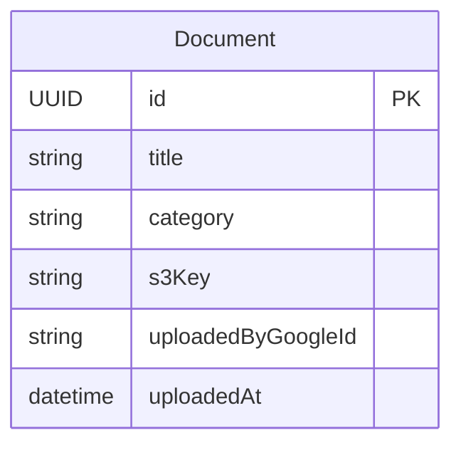

# Functional Specification — pdf-library-unit

## Workflow: Browse and Download Documents (public)

```
Flow: Browse the PDF library by category and download a document
Persona: Any reader, signed in or not
Trigger: The reader opens the library, optionally filters by category
Steps:
  1. Query documents, optionally filtered by category (BR6.5)
  2. To download, request a time-limited pre-signed S3 URL for the chosen document
Success outcome: The reader can see documents in each category and download the PDF
Error paths:
  - Query or download-URL request fails (network, backend error): plain-language error message with a retry action
```

## Workflow: Upload Document

```
Flow: An admin uploads a new PDF into a fixed category
Persona: A signed-in identity in the Admin group (Contract 2)
Trigger: An admin selects a category, a title, and a PDF file to upload
Steps:
  1. Verify the caller is in the Admin group (BR6.3)
  2. Validate category is one of the three fixed values (BR6.1)
  3. Call createDocumentUploadUrl to get a pre-signed S3 upload URL and s3Key
  4. The admin's client uploads the PDF bytes directly to S3 using that URL — the file never transits this Unit's own API, so there is no payload-size limit imposed by this Unit (BR6.2)
  5. Once the direct upload succeeds, call confirmDocumentUpload(s3Key, title, category) — the client re-supplies the same title/category it already used in step 3, since this API holds no server-side "pending upload" state to remember them (amended at Infrastructure Design, review fix); this verifies the uploaded object is actually a PDF and creates the Document record with uploadedByGoogleId set to the caller's identity (BR6.2)
Success outcome: The document appears in its category, publicly browsable and downloadable
Error paths:
  - Caller is not an admin: refuse (BR6.3)
  - Category is invalid: reject before a pre-signed URL is even issued
  - The direct-to-S3 upload itself fails (network): the admin's client retries the upload against the same pre-signed URL, or requests a new one if it expired; no Document record exists yet, so nothing is left partially created
  - confirmDocumentUpload finds the uploaded object is not a PDF: the object is deleted from S3 and no Document record is created (BR6.2); the re-supplied title/category are simply discarded along with it
  - confirmDocumentUpload fails for an infrastructure reason after a valid PDF was uploaded: surface a plain-language error and allow retry; the S3 object still exists, so retrying confirmDocumentUpload (rather than re-uploading) is sufficient
```

## Workflow: Delete Document

```
Flow: An admin permanently deletes a document
Persona: A signed-in identity in the Admin group
Trigger: An admin deletes a document
Steps:
  1. Verify the caller is in the Admin group (BR6.3)
  2. Remove the S3 file FIRST (BR6.4)
  3. Only once the S3 removal succeeds, remove the Document record
Success outcome: The document is gone completely — no longer listed, and its S3 file is removed
Error paths:
  - Caller is not an admin, or the document does not exist: refuse
  - The S3 file removal fails: the Document record is left untouched (still listed, still downloadable) and the whole operation is reported as failed — retry deletion from the start
  - The S3 file removal succeeds but the record removal then fails: the record remains, now pointing at a file that no longer exists; this is the one recoverable failure state BR6.4 accepts — it surfaces as a plain-language error, and retrying the delete (which re-attempts the now-already-gone S3 removal as a no-op, then removes the record) resolves it. The library never ends up with a downloadable file whose record was already removed — that ordering is never possible.
```

## State Machine

Not applicable in the sense of a multi-state lifecycle — a `Document` exists from upload until it is hard-deleted (BR6.4), at which point the record itself is gone rather than transitioning to another state. There is no soft-delete or status field to model transitions for, unlike FeedUnit's `Post`.

## Entity-Relationship Diagram



<!-- Text fallback: PdfLibraryUnit owns a single entity, Document, with no
relationships to other entities — uploadedByGoogleId is a plain reference to
the Cognito identity, not a modeled relationship. -->

## Rules Summary (derived from rules.md)

| Rule | Statement (short form) |
|---|---|
| BR6.1 | Category must be one of the three fixed values |
| BR6.2 | Upload must be a PDF, no size limit |
| BR6.3 | Only admins can upload/delete |
| BR6.4 | Delete is hard — record and S3 file both removed |
| BR6.5 | Public browse/download, no sign-in required |
