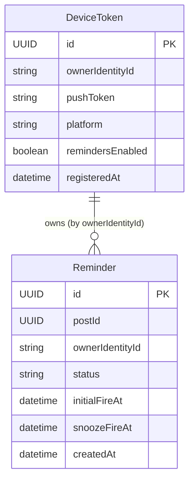

# Functional Specification — reminder-unit

## Workflow: Register Device Token

```
Flow: A device registers itself for push notifications
Persona: Any app instance, no sign-in required (BR7.6)
Trigger: The app requests OS notification permission and obtains a push token, typically on first launch or after permission is granted
This is what makes server-triggered push delivery possible (BR7.11) rather than a local, on-device-scheduled notification.
Steps:
  1. Resolve the caller's Cognito guest (unauthenticated) identity (BR7.6) — no Google sign-in involved
  2. Call registerDeviceToken(pushToken, platform) (Contract 9)
  3. If a DeviceToken already exists for (ownerIdentityId, pushToken), update registeredAt rather than creating a duplicate (idempotent)
  4. If this is a new DeviceToken, default remindersEnabled to true
Success outcome: The device can now receive push reminders, on by default
Error paths:
  - OS notification permission denied: no DeviceToken is registered; the app has no reminder capability for this device until permission is granted — FlutterAppUnit's concern to surface, not this Unit's
  - Registration request fails (network, backend error): plain-language error, retry available
```

## Workflow: View My Reminders (sync — also where lazy auto-creation happens)

```
Flow: A device fetches its own reminders, backfilling any missing ones for Event posts it hasn't seen yet
Persona: Any device with a registered guest identity
Trigger: The app calls myReminders (Contract 9), typically on launch or when the Feed/Calendar screen loads
Steps:
  1. Resolve the caller's guest identity (BR7.6)
  2. Call FeedUnit's listPosts (Contract 3, amended to add ReminderUnit as a second consumer) to enumerate current Posts
  3. For every returned Post with type = EVENT and no existing Reminder for this device, create one (status SCHEDULED, initialFireAt per BR7.2) — but only if this device's DeviceToken.remindersEnabled is true (BR7.1, BR7.7)
  4. Return every Reminder owned by this device's identity, including any CLEARED or CANCELLED ones (the client may choose to hide terminal reminders from the primary view, but this query itself does not filter them out)
Success outcome: The device's reminder set is up to date with every Event post it has synced since, respecting its own on/off preference
Error paths:
  - No DeviceToken registered yet for this identity: return an empty list — no Reminders are auto-created for a device with no registered token (registration must happen first)
  - The listPosts call fails (network, backend error): return the device's already-existing Reminders without attempting backfill this time; do not fail the whole sync over an enumeration failure — retry the backfill on the next sync
  - Query fails (network, backend error): plain-language error message with a retry action
```

## Workflow: Auto-Clear (scheduled sweep)

```
Flow: Transition a Reminder to CLEARED once its Post's dateTime has passed
Persona: System-triggered — the same scheduled-compute mechanism that delivers push notifications at a Reminder's fire time (mechanism deferred to Infrastructure Design)
Trigger: The scheduled-compute mechanism runs for a Reminder (at its own fire time, or on whatever cadence Infrastructure Design chooses for this check)
Steps:
  1. For a Reminder in SCHEDULED, SNOOZED, or FIRED status, check whether its Post's dateTime has passed
  2. If so, set status = CLEARED (BR7.4) — this is an explicit write, not a value computed only at read time, resolving the ambiguity Contract 9's Open Questions table left for this stage
  3. CANCELLED Reminders are never touched by this sweep — a user's cancellation is already final
Success outcome: A Reminder's status reflects reality (CLEARED) once its event has passed, whether or not it ever fired or was acted on
Error paths:
  - The sweep itself fails for a given Reminder: retried on the mechanism's own next cycle; a temporarily-stale (not-yet-CLEARED) Reminder is not a correctness problem, only a staleness one
```

## Workflow: Set Reminders Enabled (app-wide toggle)

```
Flow: A user turns all reminders on or off for their device
Persona: Any device with a registered guest identity
Trigger: The user toggles the app-wide reminders switch
Steps:
  1. Resolve the caller's guest identity (BR7.6)
  2. Call setRemindersEnabled(enabled) (Contract 9)
  3. Set DeviceToken.remindersEnabled; do NOT modify any existing Reminder (BR7.7 — already-scheduled/snoozed reminders are untouched; only future auto-creation on the next sync is affected)
Success outcome: Future syncs stop creating new Reminders for this device (if disabled) or resume creating them (if re-enabled); nothing changes about Reminders that already exist
Error paths:
  - Request fails (network, backend error): plain-language error, retry available; the toggle's prior value remains in effect until the request succeeds
```

## Workflow: Snooze Reminder

```
Flow: A user snoozes a fired or about-to-fire reminder
Persona: The device that owns the Reminder
Trigger: The user taps Snooze on a reminder notification or in-app control
Steps:
  1. Verify the caller's guest identity matches the Reminder's ownerIdentityId (BR7.3)
  2. If the Reminder is already SNOOZED, no-op — return it unchanged (BR7.3, clarified at
     NFR Design: snoozeFireAt is always the same fixed 9:00 PM IST time regardless of when
     snooze is tapped, so a second snooze has no actual effect to apply)
  3. If the Reminder is already FIRED, CLEARED, or CANCELLED, no-op (BR7.10 — idempotent)
  4. If current IST time is already past 9:00 PM the same day, refuse (BR7.3)
  5. Otherwise, set snoozeFireAt to 9:00 PM IST the same day and status = SNOOZED
Success outcome: The reminder will re-fire at the fixed 9:00 PM IST time
Error paths:
  - No Reminder exists with the given id: refuse with a "not found" error, distinct from the ownership-refusal case below
  - Caller does not own this Reminder: refuse
  - 9:00 PM IST has already passed: refuse with a plain-language message — no further reminder will fire for this event
  - Request fails (network, backend error): plain-language error, retry available
```

## Workflow: Cancel Reminder

```
Flow: A user cancels a reminder for a specific event
Persona: The device that owns the Reminder
Trigger: The user cancels a reminder for an individual event, at any time (BR7.5)
Steps:
  1. Verify the caller's guest identity matches the Reminder's ownerIdentityId (BR7.5)
  2. If the Reminder is already FIRED, CLEARED, or CANCELLED, no-op (BR7.10 — idempotent)
  3. Otherwise, set status = CANCELLED
Success outcome: No further notification fires for this event on this device; the user can re-acquire a reminder for it only by... there is no re-enable path for a single cancelled Reminder in this release (matches FR7.7's "cancel," not "toggle per event")
Error paths:
  - No Reminder exists with the given id: refuse with a "not found" error, distinct from the ownership-refusal case below
  - Caller does not own this Reminder: refuse
  - Request fails (network, backend error): plain-language error, retry available
```

## Workflow: Post Change Notification Handling (Contract 8 consumer)

```
Flow: React to a Post's deletion (PostDateTimeChanged needs no reaction — see below)
Persona: System-triggered — ReminderUnit's own Lambda, consuming Contract 8's DynamoDB Streams events from FeedUnit's Post table
Trigger: A PostDateTimeChanged or PostDeleted event arrives (Contract 8)
Steps:
  1. (PostDateTimeChanged) No-op — simplified at NFR Design review, per the builder's
     explicit simplicity-over-completeness choice (BR7.8). No Reminder lookup, no write.
     A DATE change is instead picked up the next time an affected device calls
     myReminders, via BR7.1's widened backfill condition (it creates an additional
     Reminder for the new date, leaving any existing stale-dated Reminder untouched).
  2a. (PostDeleted) Check idempotency: if this exact (postId, updatedAt/sequence) was
      already processed, no-op (BR7.10)
  2b. (PostDeleted) Look up any Reminder(s) for this postId
  2c. (PostDeleted) For each SCHEDULED/SNOOZED Reminder found: set status = CANCELLED (BR7.9)
  2d. (PostDeleted) A Reminder already FIRED, CLEARED, or CANCELLED is left unchanged (BR7.10)
Success outcome: A deleted Post's Reminders are cancelled; a Post's dateTime change is
  picked up lazily on the affected device's next sync instead of being pushed immediately
Error paths:
  - PostDeleted, no Reminder exists for this postId (no device had synced yet): no-op, nothing to react to
  - PostDeleted, Lambda processing fails: the DynamoDB Streams event-source mapping's own retry mechanism redelivers the record; BR7.10's idempotency makes a retry safe
```

## State Machine — Reminder.status

| Current State | Event | Guard Condition | Next State | Actions |
|---|---|---|---|---|
| — | Device syncs (myReminders), no existing Reminder for this Post with the currently-correct initialFireAt (BR7.1, widened) | DeviceToken.remindersEnabled = true (BR7.1) | SCHEDULED | Set initialFireAt (BR7.2) |
| SCHEDULED | Fire time reached, push delivered | — | FIRED | Notification sent |
| SCHEDULED | User snoozes | Before 9:00 PM IST same day (BR7.3) | SNOOZED | Set snoozeFireAt |
| SNOOZED | Snooze fire time reached, push delivered | — | FIRED | Notification sent |
| SCHEDULED, SNOOZED, FIRED | Post's dateTime passes | — | CLEARED | Auto-clear via scheduled sweep (BR7.4) — reachable even from FIRED, confirmed at the redo pass |
| SCHEDULED, SNOOZED | User cancels | Caller owns the Reminder (BR7.5) | CANCELLED | — |
| SCHEDULED, SNOOZED | Post deleted (Contract 8 PostDeleted) | — | CANCELLED | System-triggered cancel (BR7.9) |

`PostDateTimeChanged` no longer appears as a transition-triggering event in this table (simplified to a no-op at NFR Design review, BR7.8): it never changes any existing Reminder's status or fields. A DATE change instead surfaces as an ADDITIONAL Reminder appearing on the affected device's next sync (BR7.1, widened) — a new row in this same state machine for a new Reminder id, not a transition of the existing one. `FIRED` is no longer terminal on its own — it also transitions to `CLEARED` once the Post's dateTime passes (see the auto-clear row above). `CLEARED` and `CANCELLED` are the two true terminal states, and neither has any outgoing transition now that BR7.8's revival path is gone: `CANCELLED` because a user's explicit cancellation is final; `CLEARED` because reviving it in place is exactly the behavior BR7.8's simplification removed (a device instead gets a fresh Reminder via BR7.1 if the Post's date has actually changed since). A `PostDeleted` or `cancelReminder`/`snoozeReminder` call against a Reminder already `FIRED` (for snooze/cancel) or `CANCELLED` is an idempotent no-op (BR7.10), not a rejected/invalid transition — this is deliberate, since Contract 8's events can be redelivered and a user can tap a stale notification action after the reminder already resolved another way. A `snoozeReminder` call against a Reminder already `SNOOZED` (i.e. `SNOOZED -> SNOOZED`, not listed as a separate row above since it is not a real state transition) is likewise an idempotent no-op, clarified at NFR Design: `snoozeFireAt` is always the same fixed 9:00 PM IST time, so a second snooze call has nothing new to apply.

## Entity-Relationship Diagram



<!-- Text fallback: ReminderUnit owns two entities, Reminder and DeviceToken,
linked only by the shared ownerIdentityId value (a guest Cognito identity),
not a formal foreign-key relation in the GraphQL schema. Reminder.postId is
a plain reference to FeedUnit's Post entity, outside this Unit. -->

## Rules Summary (derived from rules.md)

| Rule | Statement (short form) |
|---|---|
| BR7.1 | Reminders created lazily per device on sync, on by default |
| BR7.2 | Initial fire time: 9:00 AM IST day before |
| BR7.3 | Snooze fires at fixed 9:00 PM IST same day, or refused if already passed |
| BR7.4 | Auto-clear once the event's dateTime has passed |
| BR7.5 | User can cancel their own Reminder anytime |
| BR7.6 | No sign-in — guest identity only |
| BR7.7 | App-wide toggle only suppresses future auto-creation |
| BR7.8 | Reschedule on Post dateTime change (Contract 8) |
| BR7.9 | Auto-cancel on Post delete (Contract 8) |
| BR7.10 | Idempotent event handling and cancel |
| BR7.11 | Delivery is server-triggered push, not local notifications |
