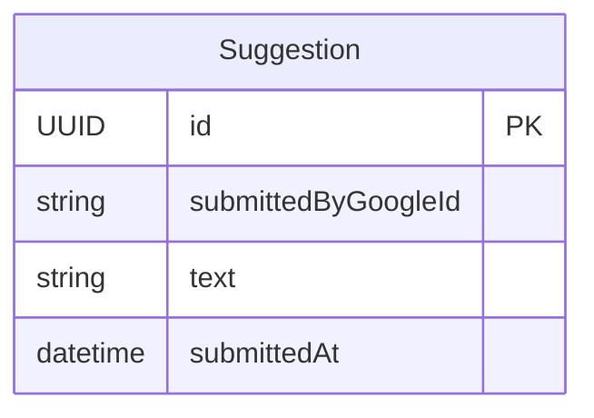

# Functional Specification — suggestion-unit

## Workflow: Submit Suggestion

```
Flow: A signed-in user submits a free-text suggestion
Persona: Any signed-in user
Trigger: The user writes a suggestion and submits it
Steps:
  1. Verify the caller is signed in (BR3.2) — submittedByGoogleId is set to the caller's identity
  2. Validate the text is at most 300 words, whitespace-tokenized (BR3.1)
  3. Atomically check-and-increment the caller's SuggestionDailyCount for today's IST date; if the conditional increment fails (already at 5), reject (BR3.5)
  4. Create the Suggestion record with id as its identifier (matching Contract 4)
Success outcome: The suggestion is saved and attributed to the submitter; it will appear in the submitter's own past-suggestions list and in the admin list
Error paths:
  - Caller is not signed in: refuse (BR3.2)
  - Text exceeds 300 words: reject before saving (BR3.1)
  - Caller has already submitted 5 suggestions today (IST): the atomic counter's conditional increment fails, and the submission is rejected with a plain-language message; the user can try again after IST midnight (BR3.5)
  - Infrastructure/network failure while saving: plain-language error message with a retry action
```

## Workflow: View My Past Suggestions

```
Flow: A signed-in user views their own previously submitted suggestions
Persona: Any signed-in user
Trigger: The user opens their past-suggestions list
Steps:
  1. The AppSync `myPastSuggestions` query carries an owner-field auth rule (`allow: owner`, keyed on submittedByGoogleId) — an unauthenticated caller is refused at the authorization layer before any resolver logic runs (BR3.3)
  2. Query suggestions where submittedByGoogleId = caller's identity (BR3.3, FR3.4), newest first
Success outcome: The user sees only their own past suggestions, newest first
Error paths:
  - Caller is not signed in: refused by the AppSync authorization layer (BR3.3)
  - Query fails (network, backend error): plain-language error message with a retry action
```

## Workflow: View All Suggestions (admin)

```
Flow: An admin reviews all submitted suggestions
Persona: A signed-in identity in the Admin group (Contract 2)
Trigger: The admin opens the suggestions list
Steps:
  1. The AppSync `allSuggestions` query carries a group auth rule (`allow: groups, groups: ["Admin"]`) — a non-admin caller is refused at the authorization layer before any resolver logic runs (BR3.3)
  2. Query all Suggestion records, newest first (consistent with the submitter's own past-suggestions ordering)
Success outcome: The admin sees every submitted suggestion, newest first, with no read/resolved-tracking state to manage (BR3.6)
Error paths:
  - Caller is not an admin: refused by the AppSync authorization layer (BR3.3)
  - Query fails (network, backend error): plain-language error message with a retry action
```

## State Machine

Not applicable — a `Suggestion` has no status field or lifecycle. It exists from submission onward with no transitions: no delete (BR3.4), no read/resolved tracking (BR3.6).

## Entity-Relationship Diagram



<!-- Text fallback: SuggestionUnit owns a single entity, Suggestion, with no
relationships to other entities — submittedByGoogleId is a plain reference to
the Cognito identity, not a modeled relationship. -->

## Rules Summary (derived from rules.md)

| Rule | Statement (short form) |
|---|---|
| BR3.1 | Suggestion text up to 300 words (not characters) |
| BR3.2 | No anonymous submission; tied to caller identity |
| BR3.3 | Visible only to submitter (self) or admin (all), enforced via AppSync owner/group auth |
| BR3.4 | No delete capability — suggestions are permanent |
| BR3.5 | Max 5 submissions per person per IST calendar day, atomically enforced |
| BR3.6 | No admin read/resolved-tracking mechanism |
