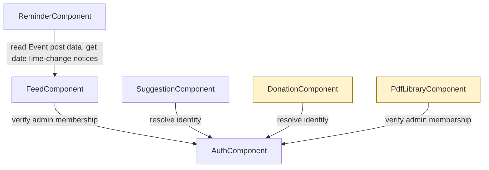

# Domain Design — Component Catalogue

Digamber Jain Temple Community App (Sarovar Jinalaya). Covers the full domain — first release (Auth, Feed, Suggestion Box, Calendar & Reminders) and later release (Donations, PDF Library) — per the builder's confirmed decision to map the whole picture now. [Q1]

> **Amended** — `ReminderComponent` added via a redo pass (backward jump from `nfr-requirements`) after the builder requested a new first-release Calendar & Reminders capability mid-Construction. See `requirements.md` FR7.1-FR7.8 and this stage's `domain-design-questions.md` (Calendar & Reminders addition) for the interview this amendment is grounded in.

## Part A — Component Catalogue

```yaml
components:
  - name: AuthComponent
    summary: Resolves the signed-in Google identity and decides whether it belongs to the admin allowlist.
    behaviour: >
      Verifies the Cognito-federated Google sign-in and exposes a single business
      rule to every other component: "is this signed-in identity an admin?"
      The admin allowlist itself is managed as a backend-only, database-level
      process by the app owner — there is no in-app admin UI for managing it.
    responsibilities:
      - Resolve the current signed-in user's identity from the Cognito session
      - Check whether that identity is present in the admin allowlist
      - Own the admin allowlist as data (not as an in-app management feature)
    depends_on: []
    dependents:
      - component: FeedComponent
        interaction: verify admin allowlist membership before allowing a post to be created, edited, or deleted
      - component: SuggestionComponent
        interaction: resolve the signed-in user's identity to attribute a submitted suggestion
      - component: DonationComponent
        interaction: resolve the signed-in user's identity to attribute a donation
      - component: PdfLibraryComponent
        interaction: verify admin allowlist membership before allowing a document to be uploaded
    external_dependencies:
      - name: Cognito (Google federation)
        kind: third-party-api
        purpose: authenticate the user via their Google account
      - name: DynamoDB (via Amplify Data)
        kind: database
        purpose: store the admin allowlist (AdminAllowlistEntry)
    entities:
      - name: AdminAllowlistEntry
        identifier: googleAccountEmail
        attributes: [googleAccountEmail, addedAt]

  - name: FeedComponent
    summary: Owns temple happenings posts — event dates, visiting-dignitary announcements, and (later) donation call-outs.
    behaviour: >
      Public read access to all posts, most-recent-first. Only admins (per
      AuthComponent) may create, edit, or delete a post. A post ages out of
      the default feed view 1 day after its event date but is not deleted.
    responsibilities:
      - Own feed post content and lifecycle (create, edit, delete)
      - Serve posts to public and signed-in readers alike
      - Apply the 1-day post-event age-out rule to the default view
    depends_on:
      - component: AuthComponent
        interaction: verify admin allowlist membership before allowing a post to be created, edited, or deleted
        style: sync
    dependents:
      - component: ReminderComponent
        interaction: read Event-type post data (type, dateTime) to schedule reminders, and receive notice when a post's dateTime changes so a scheduled reminder can be rescheduled
    external_dependencies:
      - name: DynamoDB (via Amplify Data)
        kind: database
        purpose: store feed posts
    entities:
      - name: Post
        identifier: postId
        attributes: [postId, type, title, description, dateTime, createdByGoogleId, createdAt, updatedAt]

  - name: ReminderComponent
    summary: Owns day-before event reminders — scheduling, snooze, auto-clear, and cancellation — delivered as push notifications. (Added via the Calendar & Reminders redo pass.)
    behaviour: >
      For every Event-type Post (Visiting Dignitary posts are excluded — FR7.1),
      a reminder is created automatically (on by default, FR7.2) and fires as a
      push notification at 9:00 AM IST the day before the event (FR7.4). The
      user can snooze it, which re-fires it at a fixed 9:00 PM IST the same day
      (or not at all if that time has passed, FR7.5), cancel it for that one
      event at any time (FR7.7), or turn all reminders off app-wide. A reminder
      auto-clears once the event's own dateTime has passed (FR7.6). When
      FeedComponent reports that a Post's dateTime changed, any scheduled
      reminder for it is automatically rescheduled against the new time — no
      manual user action needed. Push delivery uses a Cognito guest
      (unauthenticated identity pool) identity per device, not a signed-in
      Google identity — no sign-in is required for any reminder action (FR7.8,
      resolved by this stage: Amplify Data's guest authorization mode covers
      device-token registration and reminder management).
    responsibilities:
      - Own reminder scheduling state (initial fire time, snoozed fire time, status) per Event post per device
      - Register and own device push tokens against a guest (unauthenticated) Cognito identity
      - Deliver day-before push notifications and process snooze/cancel/app-wide-off actions
      - Auto-clear a reminder once its event's dateTime has passed
      - Reschedule a reminder when FeedComponent reports its Post's dateTime changed
    depends_on:
      - component: FeedComponent
        interaction: read Event-type post data (type, dateTime) to schedule reminders, and receive notice when a post's dateTime changes so a scheduled reminder can be rescheduled
        style: sync
    dependents: []
    external_dependencies:
      - name: DynamoDB (via Amplify Data)
        kind: database
        purpose: store Reminder and DeviceToken records
      - name: Cognito Identity Pool (guest/unauthenticated access)
        kind: third-party-api
        purpose: resolve a per-device identity for reminder ownership and push-token registration, with no Google sign-in required
      - name: Push notification delivery (e.g. Amazon SNS Mobile Push / Amplify Push Notifications)
        kind: third-party-api
        purpose: deliver day-before and snooze reminder notifications to the device
      - name: Scheduled compute (e.g. Amazon EventBridge Scheduler + Lambda)
        kind: other
        purpose: fire reminders at their scheduled 9:00 AM / 9:00 PM IST times; the exact mechanism is an Infrastructure Design decision, named here only to establish the dependency exists
    entities:
      - name: Reminder
        identifier: reminderId
        attributes: [reminderId, postId, ownerIdentityId, status, initialFireAt, snoozeFireAt, createdAt]
        references:
          - entity: Post
            owned_by: FeedComponent
            relationship: each Reminder is created for exactly one Event-type Post
      - name: DeviceToken
        identifier: deviceTokenId
        attributes: [deviceTokenId, ownerIdentityId, pushToken, platform, registeredAt]

  - name: SuggestionComponent
    summary: Owns suggestion submissions from signed-in users, visible only to admins.
    behaviour: >
      A signed-in user submits free text up to 300 words. Every suggestion is
      tied to the submitter's identity — there is no anonymous option. Only
      admins can read the list of suggestions; a submitting user can only see
      their own past submissions, never other users'.
    responsibilities:
      - Accept and store suggestion submissions
      - Enforce that a suggestion is only ever readable by its submitter (self) or an admin (all)
    depends_on:
      - component: AuthComponent
        interaction: resolve the signed-in user's identity to attribute a submitted suggestion
        style: sync
    dependents: []
    external_dependencies:
      - name: DynamoDB (via Amplify Data)
        kind: database
        purpose: store suggestions
    entities:
      - name: Suggestion
        identifier: suggestionId
        attributes: [suggestionId, submittedByGoogleId, text, submittedAt]

  - name: DonationComponent
    summary: Owns donation records and the payment-aggregator integration for UPI donations. (Later release.)
    behaviour: >
      Routes one-time and (later) recurring/Autopay UPI donations through a
      payment aggregator's tokenized flow — the app never stores or transmits
      raw payment details. On a timeout, the aggregator's own record of what
      happened is always checked before the donation's status is resolved
      one way or the other.
    responsibilities:
      - Initiate a donation through the aggregator's tokenized flow
      - Record donation status, reconciled against the aggregator's own record
      - Own the donation history for a signed-in user
    depends_on:
      - component: AuthComponent
        interaction: resolve the signed-in user's identity to attribute a donation
        style: sync
    dependents: []
    external_dependencies:
      - name: DynamoDB (via Amplify Data)
        kind: database
        purpose: store donation records
      - name: UPI payment aggregator (e.g. Razorpay)
        kind: third-party-api
        purpose: process UPI donations (one-time, later recurring/Autopay) via a tokenized flow
    entities:
      - name: Donation
        identifier: donationId
        attributes: [donationId, donorGoogleId, amount, donationType, status, aggregatorTransactionId, createdAt]

  - name: PdfLibraryComponent
    summary: Owns the browsable library of Jain religious PDFs. (Later release.)
    behaviour: >
      Public read access to documents, browsable by a fixed initial set of
      categories. Only admins may upload a document. The category structure
      itself is fixed for this release — not editable in-app.
    responsibilities:
      - Own document metadata and the fixed category list
      - Serve documents to public readers
      - Accept document uploads from admins only
    depends_on:
      - component: AuthComponent
        interaction: verify admin allowlist membership before allowing a document to be uploaded
        style: sync
    dependents: []
    external_dependencies:
      - name: DynamoDB (via Amplify Data)
        kind: database
        purpose: store document metadata (title, category, storage reference)
      - name: S3
        kind: object-store
        purpose: store the PDF files themselves
    entities:
      - name: Document
        identifier: documentId
        attributes: [documentId, title, category, s3Key, uploadedByGoogleId, uploadedAt]
```

## Part B — Human-Readable View

### Component Diagram



<!-- Text fallback: AuthComponent sits at the center. FeedComponent, SuggestionComponent,
DonationComponent, and PdfLibraryComponent each depend on AuthComponent — Feed and
PdfLibrary to verify admin membership before a mutation, Suggestion and Donation to
resolve the signed-in user's identity. ReminderComponent depends on FeedComponent
(not AuthComponent) to read Event-post data and get notice of dateTime changes; it
uses a Cognito guest identity for its own push/reminder operations, not FeedComponent's
Google-identity model. DonationComponent and PdfLibraryComponent are later-release
components (shaded), shown for completeness per the builder's confirmed decision to
map the full domain now. -->

### Component Summary

| Component | Purpose | Depends On | Dependents | Entities Owned |
|---|---|---|---|---|
| AuthComponent | Resolve signed-in identity, check admin allowlist membership | — | FeedComponent, SuggestionComponent, DonationComponent, PdfLibraryComponent | AdminAllowlistEntry |
| FeedComponent | Own temple happenings posts (First Release) | AuthComponent | ReminderComponent | Post |
| ReminderComponent | Own day-before event reminders and push delivery (First Release) | FeedComponent | — | Reminder, DeviceToken |
| SuggestionComponent | Own suggestion submissions (First Release) | AuthComponent | — | Suggestion |
| DonationComponent | Own donations and aggregator integration (Later Release) | AuthComponent | — | Donation |
| PdfLibraryComponent | Own the PDF library (Later Release) | AuthComponent | — | Document |

### Entity Ownership

| Entity | Owning Component | Identifier | Attributes | References |
|---|---|---|---|---|
| AdminAllowlistEntry | AuthComponent | googleAccountEmail | googleAccountEmail, addedAt | none |
| Post | FeedComponent | postId | postId, type, title, description, dateTime, createdByGoogleId, createdAt, updatedAt | none |
| Reminder | ReminderComponent | reminderId | reminderId, postId, ownerIdentityId, status, initialFireAt, snoozeFireAt, createdAt | references Post (FeedComponent) |
| DeviceToken | ReminderComponent | deviceTokenId | deviceTokenId, ownerIdentityId, pushToken, platform, registeredAt | none |
| Suggestion | SuggestionComponent | suggestionId | suggestionId, submittedByGoogleId, text, submittedAt | none |
| Donation | DonationComponent | donationId | donationId, donorGoogleId, amount, donationType, status, aggregatorTransactionId, createdAt | none |
| Document | PdfLibraryComponent | documentId | documentId, title, category, s3Key, uploadedByGoogleId, uploadedAt | none |

Every entity except `Reminder` owns its own data outright with no cross-component reference. `Reminder` is the one exception: it references `Post` (owned by FeedComponent) by `postId`, since a reminder only exists in relation to a specific event post — this is a plain ID reference, not a shared table or duplicated ownership. Every entity that needs to attribute an action to a person (`createdByGoogleId`, `submittedByGoogleId`, `donorGoogleId`, `uploadedByGoogleId`) stores the Cognito-federated Google identity as a plain attribute rather than a cross-component reference — see ADR-002 for why no separate User/Profile entity exists. `Reminder`/`DeviceToken`'s `ownerIdentityId` is the same pattern, but stores a Cognito guest (unauthenticated) identity id rather than a Google-federated one — see ADR-005.

### External Dependencies

| Component | Dependency | Kind | Purpose |
|---|---|---|---|
| AuthComponent | Cognito (Google federation) | third-party-api | Authenticate the user via their Google account |
| AuthComponent | DynamoDB (via Amplify Data) | database | Store the admin allowlist |
| FeedComponent | DynamoDB (via Amplify Data) | database | Store feed posts |
| ReminderComponent | DynamoDB (via Amplify Data) | database | Store Reminder and DeviceToken records |
| ReminderComponent | Cognito Identity Pool (guest/unauthenticated access) | third-party-api | Resolve a per-device identity for reminder ownership and push-token registration, with no Google sign-in required |
| ReminderComponent | Push notification delivery (e.g. Amazon SNS Mobile Push / Amplify Push Notifications) | third-party-api | Deliver day-before and snooze reminder notifications |
| ReminderComponent | Scheduled compute (e.g. Amazon EventBridge Scheduler + Lambda) | other | Fire reminders at their scheduled times; exact mechanism is an Infrastructure Design decision |
| SuggestionComponent | DynamoDB (via Amplify Data) | database | Store suggestions |
| DonationComponent | DynamoDB (via Amplify Data) | database | Store donation records |
| DonationComponent | UPI payment aggregator (e.g. Razorpay) | third-party-api | Process UPI donations via a tokenized flow |
| PdfLibraryComponent | DynamoDB (via Amplify Data) | database | Store document metadata |
| PdfLibraryComponent | S3 | object-store | Store the PDF files themselves |

### Rationale

| Component | Why it's a separate building block |
|---|---|
| AuthComponent | Distinct concern (identity and permission resolution) that every other component depends on but that itself depends on nothing else in this domain — a classic cross-cutting boundary. |
| FeedComponent | Owns a distinct entity (Post) with its own lifecycle and change rate (content changes as often as admins post events), independent of suggestions, donations, or documents. |
| ReminderComponent | Owns a distinct entity pair (Reminder, DeviceToken) with a materially different concern from FeedComponent — scheduling/notification-delivery logic and an entirely different identity model (guest, not Google-federated) — not a variation of Feed, matching the same split rationale already applied to SuggestionComponent. See ADR-005. |
| SuggestionComponent | Owns a distinct entity (Suggestion) with a materially different access rule (self-or-admin visibility) from the publicly-readable Feed and PDF library — a different concern, not a variation of Feed. |
| DonationComponent | Owns a distinct entity (Donation) with the highest-stakes integration boundary in the domain (a third-party payment aggregator) and its own reconciliation logic — isolating it limits the blast radius of anything payment-related. |
| PdfLibraryComponent | Owns a distinct entity (Document) and a distinct external dependency (S3 object storage) not shared with any other component. |

**Admin-allowlist boundary — Option A/B considered:**
- **Option A — fold into AuthComponent** (chosen): admin-membership checking and allowlist storage live inside AuthComponent, since checking "is this identity an admin" is fundamentally an authentication/authorization concern. Pros: one place owns "who can act as what"; avoids an extra component for a small, backend-managed dataset. Cons: AuthComponent's responsibility grows slightly beyond pure identity resolution. Reversible: yes — the AdminAllowlistEntry entity and its logic could be split out later with no change to any other component's public contract.
- **Option B — separate AdminManagementComponent**: rejected. The builder confirmed (Q2) that allowlist management is a backend-only, no-UI process — there's no admin-facing feature to justify a dedicated component, and splitting it out would add a boundary with nothing on the other side of it to talk to except AuthComponent itself.
- See ADR-001 for the full record.

**Post entity shape — Option A/B considered:**
- **Option A — one shared Post entity with a `type` field** (chosen): Event, Visiting Dignitary, and (later) Donation Call-out all share the same basic shape (title, date, description) today. Pros: one entity, one set of CRUD operations, less code for a solo builder to maintain. Cons: if a post type's shape diverges significantly later (e.g. Donation Call-out needs a linked donation amount or campaign), the shared shape may need optional fields or a follow-up split. Reversible: yes — Functional Design can introduce type-specific fields as optional attributes without breaking the shared shape, and a full split remains possible later.
- **Option B — separate entities per post type**: rejected for now, per the builder's preference (Q4) to keep the shape unified while the types are structurally identical.
- See ADR-003 for the full record.

**Reminder identity model — Option A/B considered:**
- **Option A — Cognito guest/unauthenticated identity per device** (chosen): reminders are owned by a per-device Cognito Identity Pool guest identity rather than a signed-in Google identity. Pros: matches the builder's strong no-sign-in preference (FR7.8) exactly; Amplify Data's guest authorization mode is a real, supported mechanism, not a workaround. Cons: a guest identity is device-local — reminders don't follow the user across a reinstall or a second device. Reversible: yes — a future pass could let a signed-in user optionally link their guest identity's reminders to their Google account without changing ReminderComponent's public shape.
- **Option B — require Google sign-in for reminders**: rejected. The builder's Q4/Q2 answers were explicit that sign-in should only be required if guest access were technically infeasible, and it isn't.
- See ADR-005 for the full record.

**Operational note — managing the admin allowlist after the app is built:** the builder asked how to add or remove admin Google accounts once the app is deployed, since there's deliberately no in-app screen for it (per Q2). Once AuthComponent's `AdminAllowlistEntry` table exists in DynamoDB (via Amplify Data), entries are added or removed directly against that table — either through the AWS Console (DynamoDB → Tables → the generated AdminAllowlistEntry table → add/delete an item with a `googleAccountEmail` and `addedAt`), or via the AWS CLI (`aws dynamodb put-item` / `delete-item` against that table). The exact table name and a copy-pasteable command will be pinned down once Functional Design and Code Generation produce the real Amplify Data schema and deployed resource names — this note establishes the mechanism now so it isn't a surprise later.

## Assumptions & Open Questions

- The exact table name and a ready-to-run AWS CLI command for managing the admin allowlist will be confirmed once Functional Design/Code Generation produce the real Amplify Data schema — not yet available at Domain Design time. [assumption]
- The exact scheduled-compute mechanism that fires reminders at their 9:00 AM/9:00 PM IST target times (e.g. EventBridge Scheduler, DynamoDB TTL + Streams, or a polling Lambda on a cron schedule) is deferred to Infrastructure Design — named here only as "scheduled compute" since the choice depends on cost and operational trade-offs outside Domain Design's scope. [assumption]
